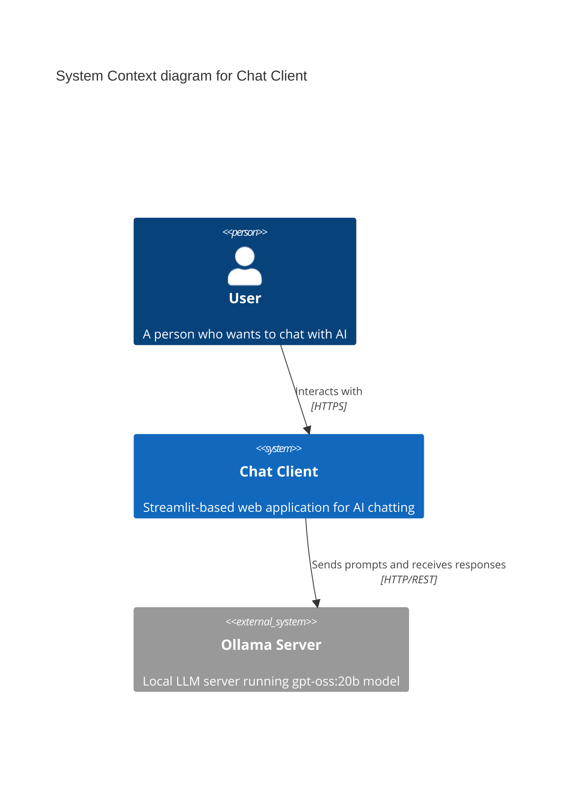
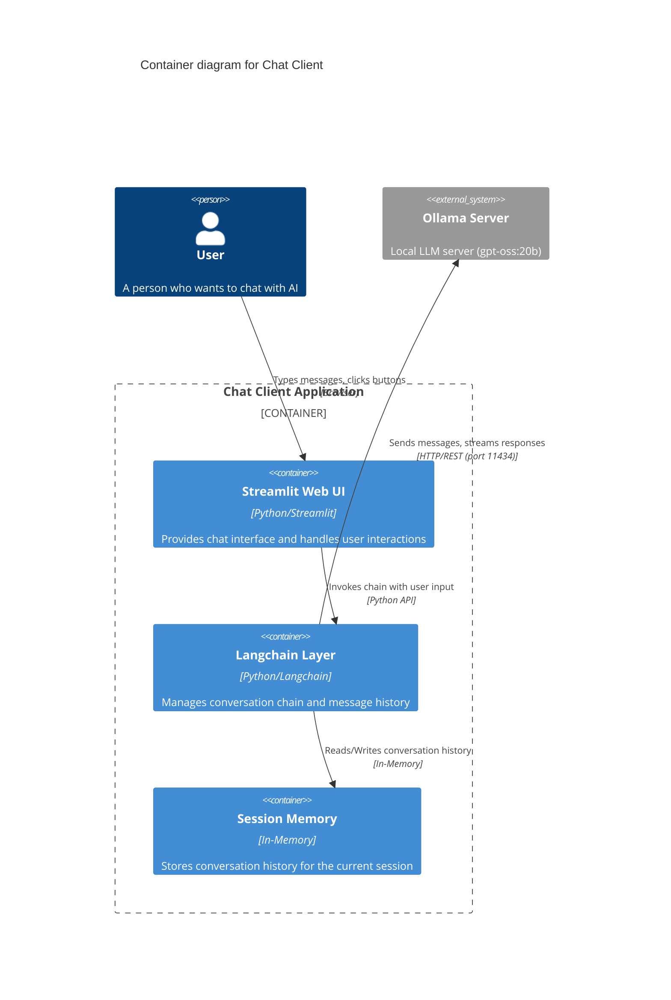
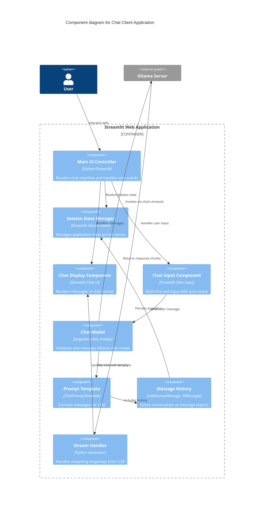
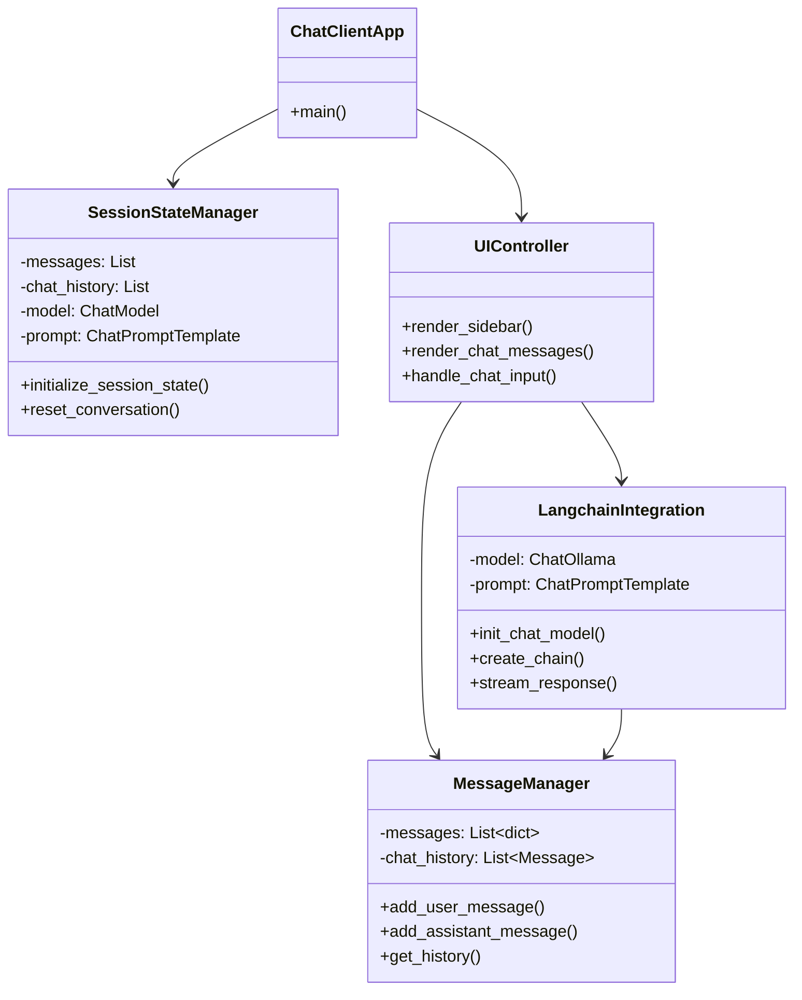
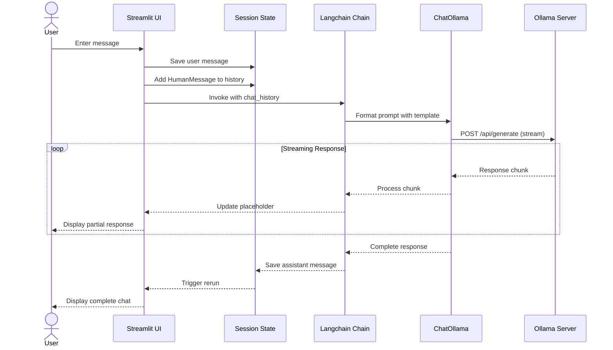

# C4 Diagram - Chat Client

## Level 1: System Context Diagram

## Level 2: Container Diagram

## Level 3: Component Diagram

## Level 4: Code Diagram (Key Functions)

## Data Flow

## Technology Stack

| Layer | Technology | Purpose |
|-------|-----------|---------|
| **Frontend** | Streamlit | Web UI framework |
| **LLM Framework** | Langchain 1.x | Chain management, message handling |
| **LLM Provider** | Ollama | Local LLM server |
| **Model** | gpt-oss:20b | Language model |
| **Memory** | In-Memory (Python List) | Session-based conversation history |
| **Language** | Python 3.10+ | Application code |

## Key Design Decisions

1. **Streaming Responses**: Uses `chain.stream()` for real-time token display
2. **Session State**: Leverages Streamlit's session_state for persistence across reruns
3. **Dual Message Storage**:
   - `messages` (dict): For UI rendering
   - `chat_history` (Message objects): For Langchain processing
4. **Auto-resize Input**: JavaScript-based textarea auto-expansion
5. **CSS Customization**: Custom styles for better UX (multi-line input, sidebar handling)
