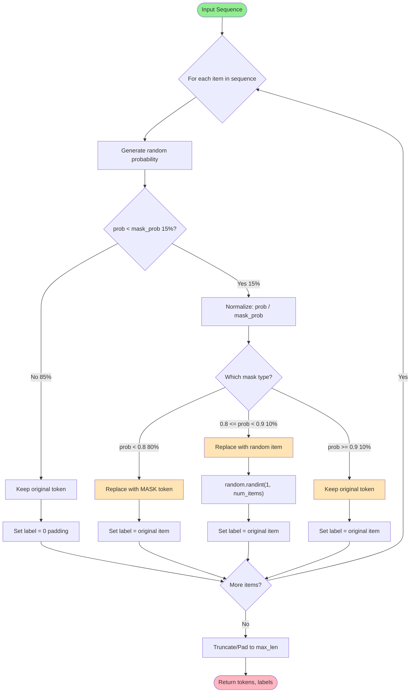

# BERT4Rec Activity Diagrams

## 1. Training Flow

```mermaid
flowchart TD
    Start([Start Training]) --> LoadConfig[Load Hydra Config]
    LoadConfig --> InitData[Initialize BERT4RecDataModule]
    InitData --> PrepareData[prepare_data: Check data file exists]
    PrepareData --> Setup[setup: Load and process data]

    Setup --> LoadCSV[Load train_ratings.csv]
    LoadCSV --> CreateMappings[Create item2idx, user2idx mappings]
    CreateMappings --> SortByTime[Sort by user_idx and time]
    SortByTime --> GroupUsers[Group interactions by user]
    GroupUsers --> FilterMin[Filter users with min_interactions]
    FilterMin --> SplitData[Split: last item for validation]
    SplitData --> LoadMetadata[Load item metadata years.tsv]
    LoadMetadata --> CalcYears[Calculate user last click years]

    CalcYears --> InitModel[Initialize BERT4Rec model]
    InitModel --> InitWeights[Initialize weights: Normal 0.02]
    InitWeights --> CreateTrainer[Create Lightning Trainer]
    CreateTrainer --> TrainingLoop{Training Loop}

    TrainingLoop --> GetBatch[Get batch from train_dataloader]
    GetBatch --> MaskSeq[BERT4RecDataset: Apply random masking]

    MaskSeq --> MaskLogic{For each item}
    MaskLogic -->|mask_prob 15%| MaskDecision{Masking decision}
    MaskDecision -->|80%| ReplaceWithMask[Replace with MASK token]
    MaskDecision -->|10%| ReplaceWithRandom[Replace with random item]
    MaskDecision -->|10%| KeepOriginal[Keep original item]
    MaskLogic -->|85% not masked| NoMask[No masking, label = 0]

    ReplaceWithMask --> PadTruncate[Pad/Truncate to max_len]
    ReplaceWithRandom --> PadTruncate
    KeepOriginal --> PadTruncate
    NoMask --> PadTruncate

    PadTruncate --> ForwardPass[Forward Pass]
    ForwardPass --> ItemEmbed[Item Embeddings]
    ItemEmbed --> PosEmbed[Add Positional Embeddings]
    PosEmbed --> EmbDropout[Dropout + LayerNorm]
    EmbDropout --> CreateMask[Create Attention Mask]

    CreateMask --> TransformerLoop{For each BERT4RecBlock}
    TransformerLoop --> MultiHead[Multi-Head Attention]
    MultiHead --> QKVProject[Q, K, V Projection]
    QKVProject --> SplitHeads[Split into num_heads]
    SplitHeads --> ScaledAttn[Scaled Dot-Product Attention]
    ScaledAttn --> AttnCalc["attn = softmax(QK^T / sqrt(d_k))"]
    AttnCalc --> AttnApply[Apply attention to V]
    AttnApply --> ConcatHeads[Concatenate heads]
    ConcatHeads --> OutputProj[Output projection + Residual + LayerNorm]

    OutputProj --> FFN[Position-wise Feed-Forward]
    FFN --> FFNExpand["W2(GELU(W1(x)))"]
    FFNExpand --> FFNResidual[Residual + LayerNorm]
    FFNResidual --> NextBlock{More blocks?}
    NextBlock -->|Yes| TransformerLoop
    NextBlock -->|No| OutputLayer

    OutputLayer --> EmbeddingShare{share_embeddings?}
    EmbeddingShare -->|Yes| MatMul["logits = seqs @ item_emb.weight^T"]
    EmbeddingShare -->|No| Linear["logits = Linear(seqs)"]
    MatMul --> ComputeLoss
    Linear --> ComputeLoss

    ComputeLoss[Compute CrossEntropyLoss]
    ComputeLoss --> IgnorePad[Ignore padding positions]
    IgnorePad --> Backward[Backpropagation]
    Backward --> UpdateWeights[Adam Optimizer Update]
    UpdateWeights --> LogMetrics[Log train_loss]

    LogMetrics --> MoreBatches{More batches?}
    MoreBatches -->|Yes| TrainingLoop
    MoreBatches -->|No| Validation

    Validation --> ValLoop{Validation Loop}
    ValLoop --> GetValBatch[Get validation batch]
    GetValBatch --> AddMask[Add MASK token at end of sequence]
    AddMask --> ValForward[Forward pass]
    ValForward --> GetLastPos["scores = logits[:, -1, :]"]
    GetLastPos --> MaskInvalid[Mask pad_token and mask_token]
    MaskInvalid --> TopK[Get top-10 predictions]
    TopK --> CompareTarget[Compare with ground truth]
    CompareTarget --> CalcHit[Calculate Hit@10]
    CalcHit --> CalcNDCG["NDCG@10 = 1/log2(rank+2)"]
    CalcNDCG --> LogVal[Log val_hit@10, val_ndcg@10]

    LogVal --> MoreValBatches{More val batches?}
    MoreValBatches -->|Yes| ValLoop
    MoreValBatches -->|No| CheckEpoch

    CheckEpoch --> SaveCheckpoint[Save checkpoint if best val_ndcg@10]
    SaveCheckpoint --> MoreEpochs{More epochs?}
    MoreEpochs -->|Yes| TrainingLoop
    MoreEpochs -->|No| End([Training Complete])

    style Start fill:#90EE90
    style End fill:#FFB6C1
    style MaskSeq fill:#FFE4B5
    style TransformerLoop fill:#E0E0E0
    style Validation fill:#ADD8E6
```

## 2. Inference Flow

```mermaid
flowchart TD
    Start([Start Inference]) --> LoadConfig[Load Hydra Config]
    LoadConfig --> InitData[Initialize BERT4RecDataModule]
    InitData --> SetupData[setup: Load and process data]

    SetupData --> LoadTrain[Load train_ratings.csv]
    LoadTrain --> ProcessData[Process: mappings, sequences, metadata]
    ProcessData --> GetFullSeq[Get full sequences train + valid]
    GetFullSeq --> GetFuture[get_future_item_sequences]

    GetFuture --> FutureLoop{For each user}
    FutureLoop --> GetLastYear[Get user's last click year]
    GetLastYear --> CheckYear{Has click year?}
    CheckYear -->|No| EmptySet[future_items = empty set]
    CheckYear -->|Yes| FilterItems[Filter ALL items by year]
    FilterItems --> FindFuture["Find items where\nitem_year > last_click_year"]
    FindFuture --> StoreFuture[Store future items set]
    EmptySet --> NextUser{More users?}
    StoreFuture --> NextUser
    NextUser -->|Yes| FutureLoop
    NextUser -->|No| LoadCheckpoint

    LoadCheckpoint[Load checkpoint from path]
    LoadCheckpoint --> ExpandPath[os.path.expanduser to handle ~]
    ExpandPath --> LoadModel[BERT4Rec.load_from_checkpoint]
    LoadModel --> SetEval[model.eval]
    SetEval --> SetDevice[Move to CUDA/CPU]
    SetDevice --> CreateOutput[Create output directory]

    CreateOutput --> CalcPath["run_dir = dirname(dirname(checkpoint_path))"]
    CalcPath --> MakeDir["mkdir run_dir/submissions/"]
    MakeDir --> BatchLoop{For each batch of users}

    BatchLoop --> PrepSeq[Prepare sequences]
    PrepSeq --> GetUserSeq[Get full sequence train + valid]
    GetUserSeq --> PrepExclude[Prepare exclusion set]
    PrepExclude --> ExcludeInteracted[Exclude already seen items]
    ExcludeInteracted --> GetUserFuture[Get user's future items]
    GetUserFuture --> ExcludeFuture[Exclude future items]

    ExcludeFuture --> ModelPredict[model.predict]
    ModelPredict --> AddMaskToken[Add MASK token at end]
    AddMaskToken --> PadSeq[Pad/Truncate to max_len]
    PadSeq --> ConvertArray[Convert to numpy array]
    ConvertArray --> PredictForward[Forward pass]

    PredictForward --> PredictEmbed[Item + Positional Embeddings]
    PredictEmbed --> PredictTransformer[Apply Transformer blocks]
    PredictTransformer --> PredictOutput["Get scores[:, -1, :] last position"]
    PredictOutput --> MaskPadMask[Mask pad_token and mask_token]
    MaskPadMask --> ApplyExclude{Has exclude_items?}
    ApplyExclude -->|Yes| SetExcludeInf["Set scores[excluded] = -inf"]
    ApplyExclude -->|No| GetTopK
    SetExcludeInf --> GetTopK

    GetTopK[torch.topk to get top-k items]
    GetTopK --> ConvertCPU[Convert to numpy on CPU]
    ConvertCPU --> ConvertIDs[Convert indices to original IDs]
    ConvertIDs --> AppendResults[Append to results list]

    AppendResults --> MoreBatches{More batches?}
    MoreBatches -->|Yes| BatchLoop
    MoreBatches -->|No| CreateDF[Create DataFrame from results]

    CreateDF --> SaveCSV["Save to submissions/bert4rec_predictions_K_timestamp.csv"]
    SaveCSV --> LogStats[Log statistics]
    LogStats --> End([Inference Complete])

    style Start fill:#90EE90
    style End fill:#FFB6C1
    style GetFuture fill:#FFE4B5
    style ModelPredict fill:#E0E0E0
    style LoadCheckpoint fill:#ADD8E6
```

## 3. Data Masking Strategy (Detail)

## 4. Multi-Head Attention Mechanism (Detail)

```mermaid
flowchart TD
    Start([Input: enc, mask]) --> SaveResidual[residual = enc]
    SaveResidual --> ProjectQ["Q = W_Q(enc)"]
    ProjectQ --> ProjectK["K = W_K(enc)"]
    ProjectK --> ProjectV["V = W_V(enc)"]

    ProjectV --> ReshapeQ["Q.view(batch, seq_len, num_heads, head_dim)"]
    ReshapeQ --> ReshapeK["K.view(batch, seq_len, num_heads, head_dim)"]
    ReshapeK --> ReshapeV["V.view(batch, seq_len, num_heads, head_dim)"]

    ReshapeV --> TransposeQ["Q.transpose(1,2)\n[batch, num_heads, seq_len, head_dim]"]
    TransposeQ --> TransposeK["K.transpose(1,2)"]
    TransposeK --> TransposeV["V.transpose(1,2)"]

    TransposeV --> DotProduct["attn_score = Q @ K^T"]
    DotProduct --> Scale["attn_score / sqrt(head_dim)"]
    Scale --> ApplyMask["attn_score.masked_fill(mask==0, -1e9)"]
    ApplyMask --> Softmax["attn_dist = softmax(attn_score, dim=-1)"]
    Softmax --> DropoutAttn["attn_dist = dropout(attn_dist)"]

    DropoutAttn --> AttnOutput["output = attn_dist @ V"]
    AttnOutput --> TransposeBack["output.transpose(1,2)"]
    TransposeBack --> Concat["output.view(batch, seq_len, hidden_units)"]

    Concat --> OutputProj["output = W_O(output)"]
    OutputProj --> DropoutOut["output = dropout(output)"]
    DropoutOut --> AddResidual["output = output + residual"]
    AddResidual --> LayerNorm["output = LayerNorm(output)"]

    LayerNorm --> Return([Return output, attn_dist])

    style Start fill:#90EE90
    style Return fill:#FFB6C1
    style DotProduct fill:#FFE4B5
    style Softmax fill:#FFE4B5
    style AddResidual fill:#ADD8E6
```

## Key Process Highlights

### Training Process
1. **Data Preparation**: Load, map, sort, filter, split
2. **Masking Strategy**: 15% masking with 80/10/10 distribution
3. **Transformer Forward**: Item+Pos embeddings → Multi-layer attention → Output
4. **Loss Computation**: CrossEntropyLoss ignoring padding
5. **Validation**: Add mask at end → Predict → Calculate Hit@10, NDCG@10

### Inference Process
1. **Future Item Detection**: Find items with release_year > user's last_click_year
2. **Exclusion Strategy**: Exclude seen items + future items
3. **Batch Prediction**: Process users in batches for efficiency
4. **Top-K Selection**: Get top-k items after applying exclusions
5. **ID Conversion**: Convert internal indices to original IDs

### Attention Mechanism
1. **Projection**: Q, K, V linear projections
2. **Multi-Head Split**: Reshape and transpose for parallel attention
3. **Scaled Attention**: QK^T / sqrt(d_k) → Mask → Softmax → Apply to V
4. **Combine**: Concatenate heads → Output projection
5. **Residual**: Add residual + LayerNorm
