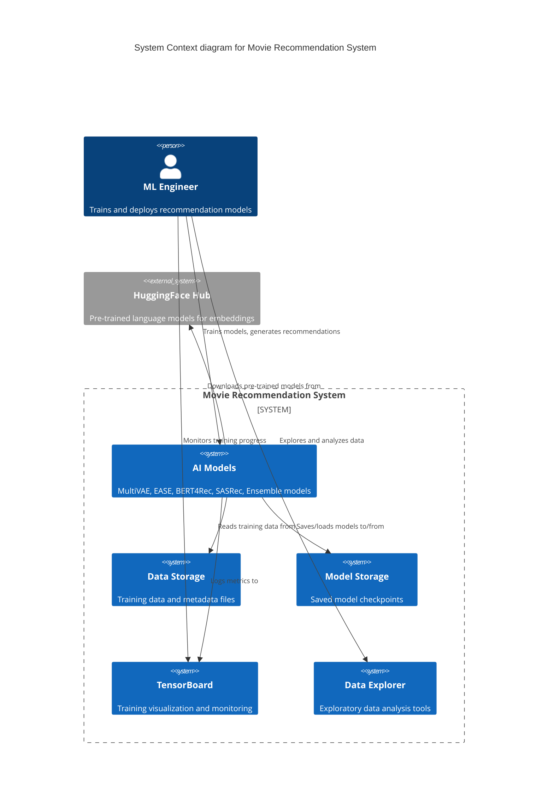
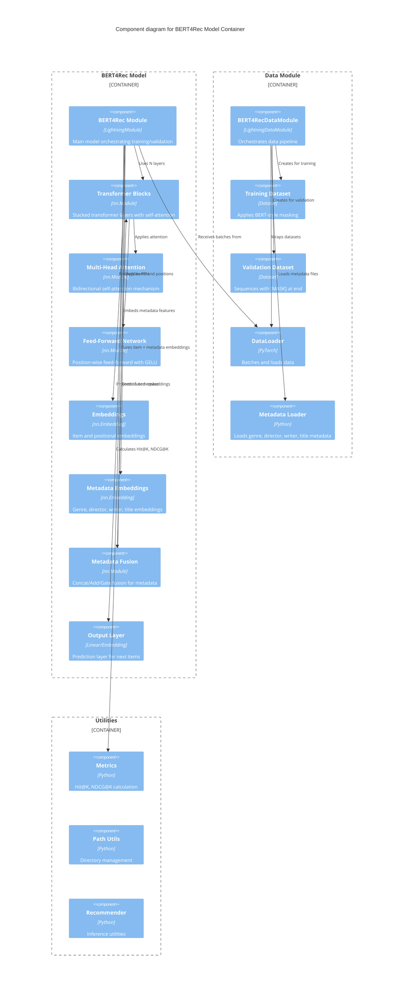
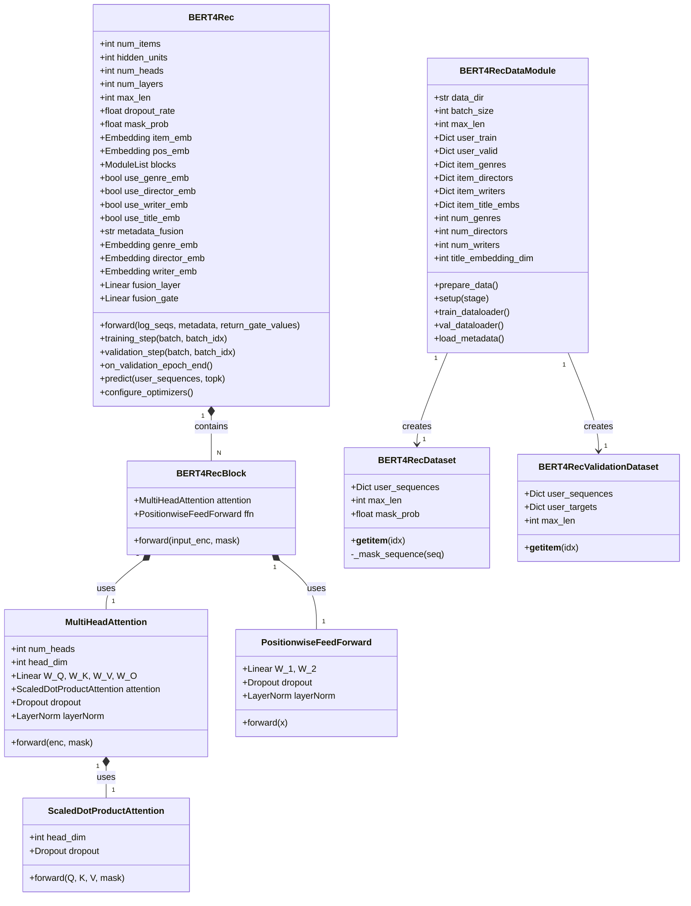
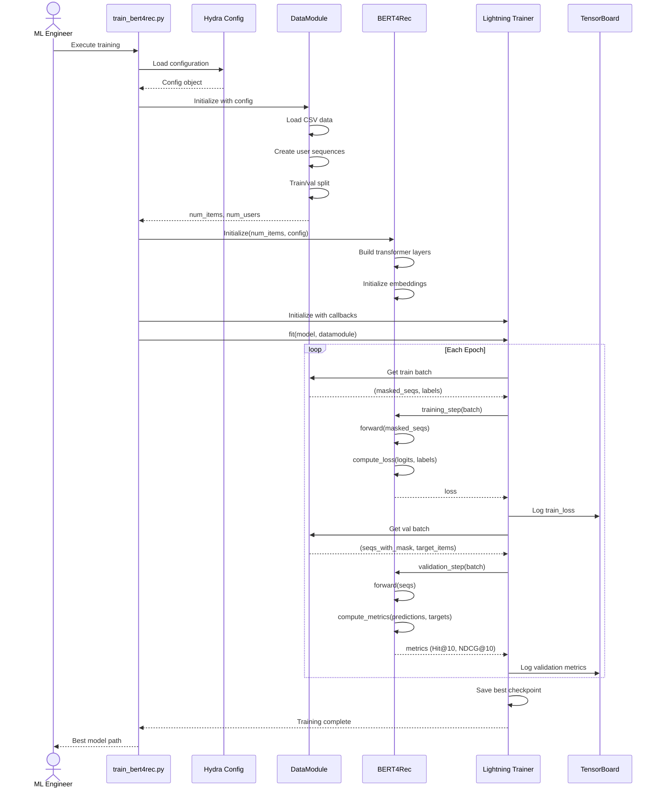
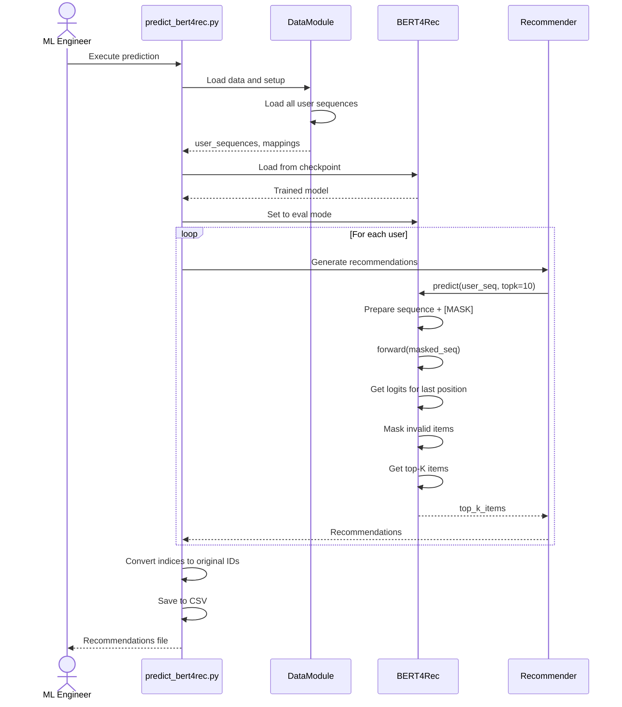
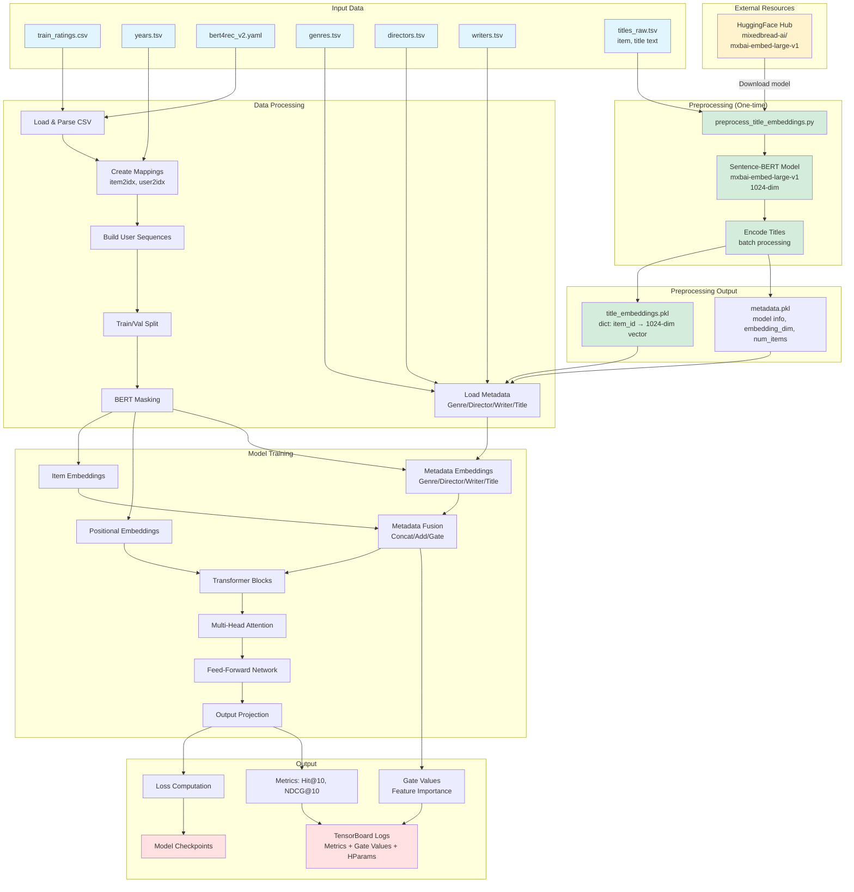
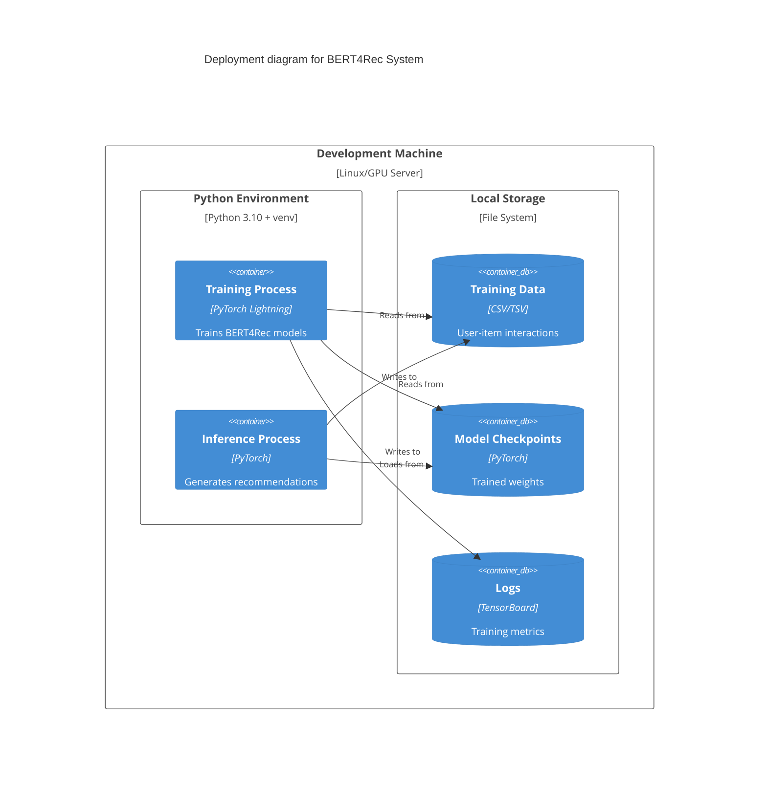
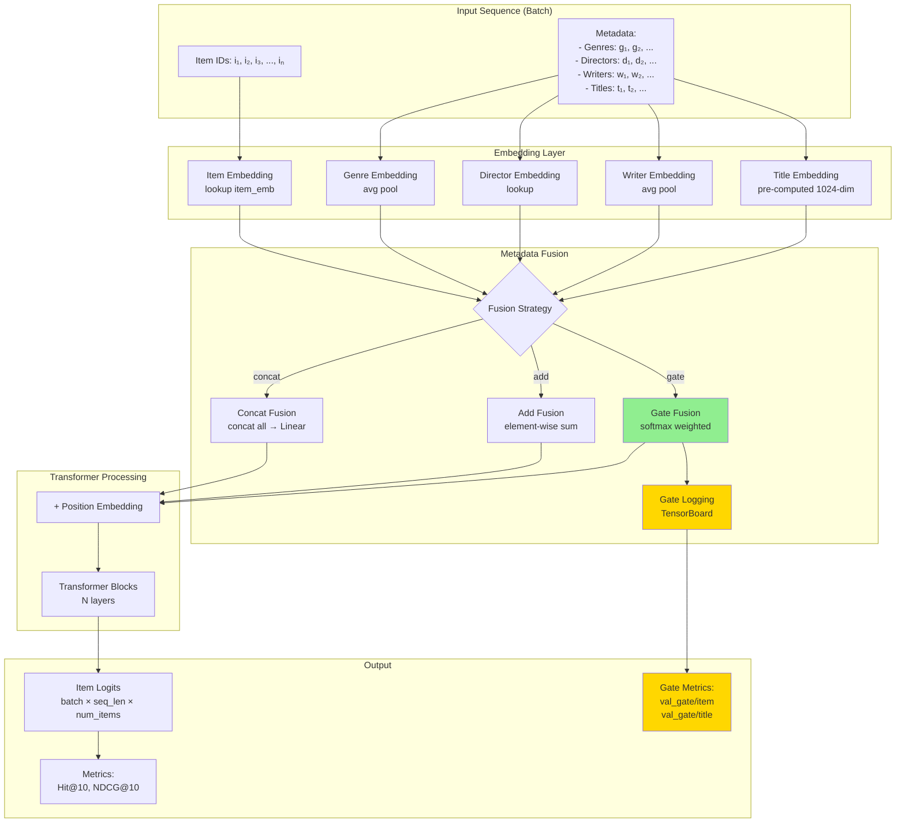

# BERT4Rec C4 Model Diagrams

## Level 1: System Context Diagram



## Level 2: Container Diagram

```mermaid
C4Container
    title Container diagram for BERT4Rec System

    Person(user, "ML Engineer", "Trains and evaluates models")

    Container_Boundary(bert4rec_system, "BERT4Rec System") {
        Container(preprocess_script, "Preprocess Script", "Python", "Generates title embeddings from raw text using Sentence-BERT")
        Container(train_script, "Training Script", "Python/Hydra", "Orchestrates training pipeline with configuration management")
        Container(predict_script, "Prediction Script", "Python", "Generates recommendations for users")
        Container(data_explorer, "Data Explorer", "Jupyter/Python", "Interactive data analysis and visualization")
        Container(model, "BERT4Rec Model", "PyTorch Lightning", "Transformer-based sequential recommendation model")
        Container(data_module, "Data Module", "PyTorch Lightning", "Handles data loading, preprocessing, and batching")
        Container(utils, "Utilities", "Python", "Metrics calculation and helper functions")
    }

    System_Ext(huggingface, "HuggingFace Hub", "Model Repository", "Sentence-BERT pre-trained models")
    System_Ext(config, "Configuration", "YAML/Hydra", "Model and training hyperparameters")
    System_Ext(data_files, "Training Data", "CSV", "User-item interaction sequences")
    System_Ext(metadata_raw, "Raw Metadata", "TSV", "Item titles, genres, directors, writers, years")
    System_Ext(title_embeddings, "Title Embeddings", "TSV", "Pre-computed title embedding vectors")
    System_Ext(checkpoints, "Checkpoints", "PyTorch", "Trained model weights")
    System_Ext(tensorboard, "TensorBoard", "Visualization", "Training metrics and logs")

    Rel(user, preprocess_script, "Runs preprocessing (one-time)")
    Rel(user, train_script, "Executes training")
    Rel(user, predict_script, "Generates recommendations")
    Rel(user, data_explorer, "Analyzes data")

    Rel(preprocess_script, huggingface, "Downloads Sentence-BERT model")
    Rel(preprocess_script, metadata_raw, "Reads title text")
    Rel(preprocess_script, title_embeddings, "Writes embedding vectors")

    Rel(train_script, config, "Reads configuration")
    Rel(train_script, model, "Initializes and trains")
    Rel(train_script, data_module, "Uses for data loading")
    Rel(predict_script, model, "Loads trained model")
    Rel(predict_script, data_module, "Uses for inference data")

    Rel(data_module, data_files, "Loads interaction data")
    Rel(data_module, metadata_raw, "Loads genres, directors, writers, years")
    Rel(data_module, title_embeddings, "Loads pre-computed embeddings")
    Rel(data_explorer, data_files, "Analyzes interaction patterns")
    Rel(data_explorer, metadata_raw, "Explores metadata distributions")

    Rel(model, utils, "Uses for metrics")
    Rel(train_script, checkpoints, "Saves best models")
    Rel(predict_script, checkpoints, "Loads models from")
    Rel(train_script, tensorboard, "Logs metrics")
```



## Level 3: Component Diagram



## Level 4: Code Diagram - BERT4Rec Architecture



## Training Sequence Diagram



## Inference Sequence Diagram



## Data Flow Diagram



## Deployment Diagram



---

## Metadata Fusion Flow Diagram



**Gate Fusion 상세 동작**:
```
1. Collect embeddings: [item_emb, genre_emb, director_emb, writer_emb, title_emb]
2. Concatenate: concat_emb = [e₁; e₂; e₃; e₄; e₅]  # [batch, seq_len, hidden*5]
3. Compute gates: gates = softmax(Linear(concat_emb))  # [batch, seq_len, 5]
4. Weight embeddings: weighted = Σ (gates[i] · embeddings[i])
5. Log gate values: val_gate/{feature_name} → TensorBoard
6. Output: fused_emb [batch, seq_len, hidden_dim]
```

---

## Key Architecture Decisions

### 1. Bidirectional Attention
- Unlike SASRec (unidirectional), BERT4Rec uses bidirectional self-attention
- Allows the model to capture context from both past and future items in the sequence
- Implemented through full attention mask (only padding is masked)

### 2. BERT-Style Training
- **Cloze Task**: Randomly mask 15% of items in sequences
  - 80%: Replace with [MASK] token
  - 10%: Replace with random item
  - 10%: Keep original
- Predicts masked items using bidirectional context

### 3. Embedding Sharing
- Output layer shares weights with item embedding (transpose)
- Reduces parameters and improves efficiency
- Configurable via `share_embeddings` parameter

### 4. Transformer Architecture
- **Layers**: 2 transformer blocks (configurable)
- **Hidden Units**: 256 dimensions
- **Attention Heads**: 4 heads
- **Feed-Forward**: 4x expansion (hidden → 1024 → hidden)
- **Activation**: GELU (more stable than ReLU for transformers)

### 5. Training Strategy
- **Optimizer**: Adam with learning rate 0.001
- **Max Sequence Length**: 200 items
- **Dropout**: 0.2 for regularization
- **Gradient Clipping**: 5.0 to prevent exploding gradients
- **Early Stopping**: Monitor validation NDCG@10 with patience 20

### 6. Validation Strategy
- Last item in sequence held out for validation
- Metrics: Hit@10, NDCG@10
- No negative sampling during evaluation (rank against all items)

### 7. Configuration Management
- Hydra framework for flexible configuration
- Easy hyperparameter tuning via command line
- Automatic experiment tracking and logging

### 8. Metadata Fusion Architecture
- **Multiple Metadata Types**: Support for genre, director, writer, and title embeddings
- **Flexible Fusion Strategies**:
  - **Concatenation**: Simple concat + linear projection
  - **Addition**: Element-wise sum (parameter-free)
  - **Gate Fusion**: Learnable weighted combination with softmax normalization
- **Gate Monitoring**: TensorBoard logging for real-time feature importance tracking
- **Modular Design**: Each metadata type can be independently enabled/disabled
- **Content + Collaborative**: Combines content-based (metadata) and collaborative filtering (item embeddings)

---

## Technology Stack

| Layer | Technology |
|-------|-----------|
| **Deep Learning Framework** | PyTorch 2.x |
| **Training Framework** | PyTorch Lightning |
| **Configuration** | Hydra + OmegaConf |
| **Logging** | TensorBoard |
| **Data Processing** | Pandas + NumPy |
| **Model Architecture** | Transformer (BERT-style) |
| **Optimizer** | Adam |

---

## File Structure

```
lightning/
├── configs/
│   └── bert4rec_v2.yaml          # Model & training configuration
├── src/
│   ├── models/
│   │   └── bert4rec.py           # BERT4Rec model implementation
│   ├── data/
│   │   └── bert4rec_data.py      # Data loading & preprocessing
│   └── utils/
│       ├── metrics.py            # Evaluation metrics
│       ├── path_utils.py         # Directory management
│       └── recommend.py          # Inference utilities
├── train_bert4rec.py             # Training script
└── predict_bert4rec.py           # Inference script
```
