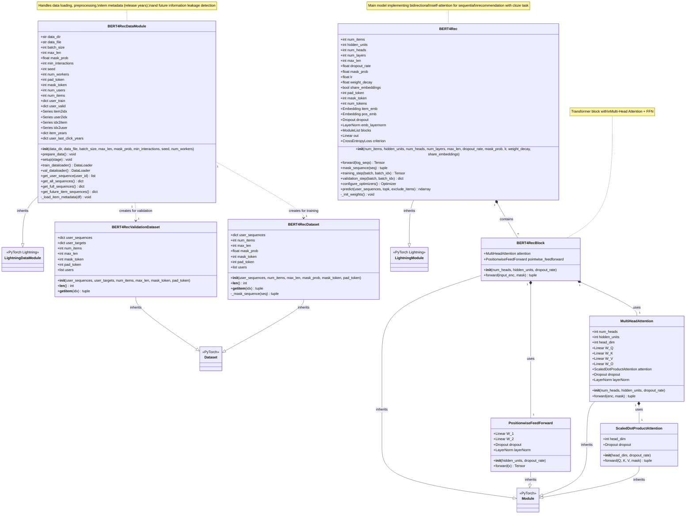

# BERT4Rec Class Diagram

## Key Design Patterns

### 1. Composition Pattern
- **BERT4Rec** composes multiple **BERT4RecBlock** modules
- Each **BERT4RecBlock** composes **MultiHeadAttention** and **PositionwiseFeedForward**
- **MultiHeadAttention** uses **ScaledDotProductAttention**

### 2. Factory Pattern
- **BERT4RecDataModule** creates appropriate dataset instances:
  - `BERT4RecDataset` for training (with masking)
  - `BERT4RecValidationDataset` for validation (with ground truth)

### 3. Strategy Pattern
- Masking strategy in `BERT4RecDataset._mask_sequence()`:
  - 80% mask token replacement
  - 10% random token replacement
  - 10% keep original

### 4. Template Method Pattern
- PyTorch Lightning's lifecycle methods:
  - `training_step()`, `validation_step()`
  - `configure_optimizers()`
  - `prepare_data()`, `setup()`

## Special Features

### Token Management
- `pad_token = 0`: Padding
- `mask_token = num_items + 1`: Masked position marker
- Item indices: `1 ~ num_items`

### Future Information Leakage Prevention
- `item_years`: Maps items to release years
- `user_last_click_years`: Tracks user's last interaction year
- `get_future_item_sequences()`: Identifies items released after user's last click

### Embedding Sharing
- Optional weight sharing between input embeddings and output layer
- Reduces parameters and improves efficiency
