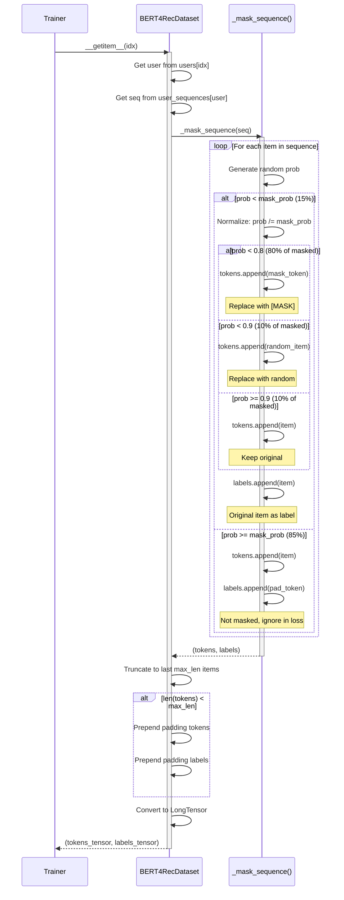
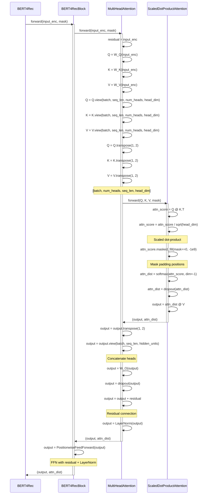
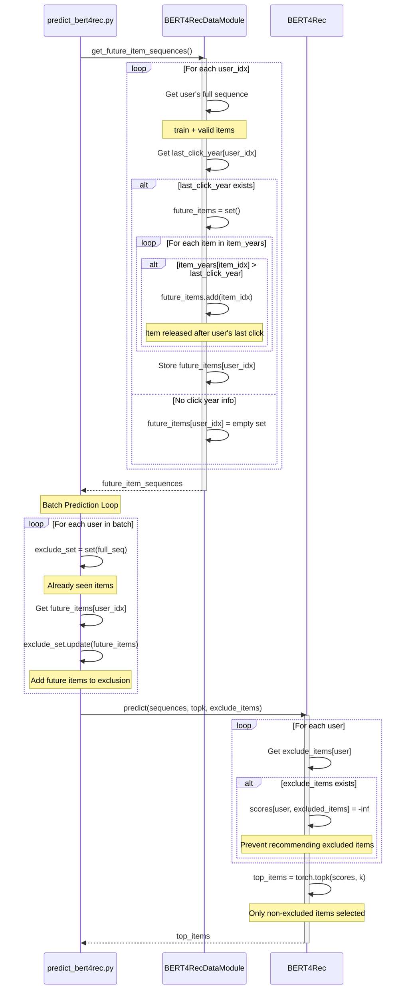

# BERT4Rec Sequence Diagrams

## 1. Training Sequence Diagram

```mermaid
sequenceDiagram
    participant User
    participant Hydra
    participant TrainScript as train_bert4rec.py
    participant DataModule as BERT4RecDataModule
    participant Dataset as BERT4RecDataset
    participant Model as BERT4Rec
    participant Trainer as Lightning Trainer
    participant Callbacks

    User->>Hydra: python train_bert4rec.py
    Hydra->>TrainScript: Load config (bert4rec.yaml)

    Note over TrainScript: Initialize Components
    TrainScript->>DataModule: __init__(data_dir, batch_size, ...)
    DataModule-->>TrainScript: DataModule instance

    TrainScript->>DataModule: setup()
    activate DataModule
    DataModule->>DataModule: Load train_ratings.csv
    DataModule->>DataModule: Create item2idx, user2idx mappings
    DataModule->>DataModule: Sort by user and time
    DataModule->>DataModule: Filter users (min_interactions)

    alt use_full_data == True
        DataModule->>DataModule: user_train[u] = seq (full)
        Note over DataModule: Full data training
    else use_full_data == False
        DataModule->>DataModule: user_train[u] = seq[:-1]
        DataModule->>DataModule: user_valid[u] = seq[-1]
        Note over DataModule: Standard split
    end

    DataModule->>DataModule: Load years.tsv
    DataModule->>DataModule: Calculate user_last_click_years
    deactivate DataModule
    DataModule-->>TrainScript: num_users, num_items

    TrainScript->>Model: __init__(num_items, hidden_units, ...)
    Model->>Model: Create embeddings, transformer blocks
    Model->>Model: Initialize weights (Normal 0.02)
    Model-->>TrainScript: Model instance

    TrainScript->>Callbacks: Create ModelCheckpoint
    alt use_full_data == True
        Callbacks->>Callbacks: monitor='train_loss', mode='min'
    else use_full_data == False
        Callbacks->>Callbacks: monitor='val_ndcg@10', mode='max'
    end

    alt use_full_data == False and early_stopping == True
        TrainScript->>Callbacks: Create EarlyStopping
    end

    TrainScript->>Trainer: __init__(max_epochs, callbacks, ...)
    Trainer-->>TrainScript: Trainer instance

    Note over TrainScript,Trainer: Training Loop Start

    alt use_full_data == True
        TrainScript->>Trainer: fit(model, train_dataloaders)
    else use_full_data == False
        TrainScript->>Trainer: fit(model, datamodule)
    end

    activate Trainer

    loop For each epoch
        Trainer->>DataModule: train_dataloader()
        DataModule->>Dataset: Create BERT4RecDataset
        Dataset-->>DataModule: Dataset instance
        DataModule-->>Trainer: DataLoader

        loop For each batch
            Trainer->>Dataset: __getitem__(idx)
            activate Dataset
            Dataset->>Dataset: Get user sequence
            Dataset->>Dataset: Apply BERT masking (15%)
            Note over Dataset: 80% [MASK], 10% random, 10% keep
            Dataset->>Dataset: Pad/Truncate to max_len
            Dataset-->>Trainer: (tokens, labels)
            deactivate Dataset

            Trainer->>Model: training_step(batch, batch_idx)
            activate Model
            Model->>Model: forward(log_seqs)

            Note over Model: Forward Pass
            Model->>Model: Item + Positional Embeddings
            Model->>Model: Dropout + LayerNorm

            loop For each Transformer Block
                Model->>Model: Multi-Head Attention
                Model->>Model: Residual + LayerNorm
                Model->>Model: Feed-Forward Network
                Model->>Model: Residual + LayerNorm
            end

            Model->>Model: Output projection (shared embeddings)
            Model->>Model: Compute CrossEntropyLoss
            Model->>Model: Log train_loss
            Model-->>Trainer: loss
            deactivate Model

            Trainer->>Trainer: Backward pass
            Trainer->>Trainer: Optimizer step
        end

        alt use_full_data == False
            Note over Trainer,DataModule: Validation Phase
            Trainer->>DataModule: val_dataloader()
            DataModule-->>Trainer: Validation DataLoader

            loop For each validation batch
                Trainer->>Model: validation_step(batch, batch_idx)
                activate Model
                Model->>Model: forward(log_seqs)
                Model->>Model: Get scores[:, -1, :]
                Model->>Model: Mask pad_token and mask_token
                Model->>Model: Get top-10 predictions
                Model->>Model: Compare with ground truth
                Model->>Model: Calculate Hit@10, NDCG@10
                Model->>Model: Log val_hit@10, val_ndcg@10
                Model-->>Trainer: metrics
                deactivate Model
            end
        end

        Trainer->>Callbacks: on_epoch_end()

        alt use_full_data == True
            Callbacks->>Callbacks: Check train_loss
            Callbacks->>Callbacks: Save if best train_loss
        else use_full_data == False
            Callbacks->>Callbacks: Check val_ndcg@10
            Callbacks->>Callbacks: Save if best val_ndcg@10

            opt Early stopping triggered
                Callbacks->>Trainer: Stop training
            end
        end
    end

    deactivate Trainer

    Trainer-->>TrainScript: Training complete
    TrainScript->>TrainScript: Log best model path
    TrainScript-->>User: Training finished
```



## 2. Inference Sequence Diagram

```mermaid
sequenceDiagram
    participant User
    participant Hydra
    participant PredictScript as predict_bert4rec.py
    participant DataModule as BERT4RecDataModule
    participant Model as BERT4Rec
    participant FileSystem

    User->>Hydra: python predict_bert4rec.py
    Hydra->>PredictScript: Load config

    PredictScript->>DataModule: __init__(...)
    DataModule-->>PredictScript: DataModule instance

    PredictScript->>DataModule: setup()
    activate DataModule
    DataModule->>DataModule: Load train_ratings.csv
    DataModule->>DataModule: Create mappings
    DataModule->>DataModule: Load years.tsv
    DataModule->>DataModule: Calculate user_last_click_years
    deactivate DataModule

    PredictScript->>DataModule: get_full_sequences()
    DataModule-->>PredictScript: full_sequences (train + valid)

    PredictScript->>DataModule: get_future_item_sequences()
    activate DataModule

    loop For each user
        DataModule->>DataModule: Get last_click_year

        alt Has click year info
            loop For all items
                alt item_year > last_click_year
                    DataModule->>DataModule: Add to future_items
                end
            end
        else No click year info
            DataModule->>DataModule: future_items = empty set
        end
    end

    deactivate DataModule
    DataModule-->>PredictScript: future_item_sequences

    PredictScript->>PredictScript: os.path.expanduser(checkpoint_path)
    Note over PredictScript: Expand ~ to home directory

    PredictScript->>Model: load_from_checkpoint(checkpoint_path)
    Model-->>PredictScript: Model instance

    PredictScript->>Model: eval()
    PredictScript->>Model: to(device)

    PredictScript->>FileSystem: Create submissions directory
    Note over PredictScript: run_dir/submissions/

    loop For each batch of users
        PredictScript->>PredictScript: Prepare batch sequences

        loop For each user in batch
            PredictScript->>DataModule: Get full_seq (train + valid)
            DataModule-->>PredictScript: full_seq

            PredictScript->>PredictScript: Create exclude_set
            PredictScript->>PredictScript: exclude_set.add(seen items)

            PredictScript->>DataModule: Get future_items[user_idx]
            DataModule-->>PredictScript: future_items

            PredictScript->>PredictScript: exclude_set.update(future_items)
            Note over PredictScript: Prevent future information leakage
        end

        PredictScript->>Model: predict(user_sequences, topk, exclude_items)
        activate Model

        Model->>Model: Add [MASK] token at end
        Model->>Model: Pad/Truncate to max_len
        Model->>Model: Convert to numpy array

        Model->>Model: forward(seqs)
        Note over Model: Forward pass through transformers

        Model->>Model: Get scores[:, -1, :]
        Note over Model: Last position predictions

        Model->>Model: Mask pad_token and mask_token
        Model->>Model: scores[excluded] = -inf
        Note over Model: Apply exclusion (seen + future items)

        Model->>Model: torch.topk(scores, k=topk)
        Model-->>PredictScript: top_items (indices)
        deactivate Model

        loop For each user in batch
            PredictScript->>DataModule: idx2user[user_idx]
            DataModule-->>PredictScript: original_user_id

            loop For each item in top_items
                PredictScript->>DataModule: idx2item[item_idx]
                DataModule-->>PredictScript: original_item_id

                PredictScript->>PredictScript: Append (user, item) to results
            end
        end
    end

    PredictScript->>PredictScript: Create DataFrame from results
    PredictScript->>FileSystem: Save to CSV
    Note over FileSystem: bert4rec_predictions_K_timestamp.csv

    PredictScript->>PredictScript: Log statistics
    PredictScript-->>User: Inference complete
```



## 3. Data Masking Sequence (Detail)



## 4. Multi-Head Attention Sequence (Detail)



## 5. Future Information Leakage Prevention Sequence



## Key Interaction Patterns

### 1. Configuration-Driven Behavior
- `use_full_data` flag controls multiple components automatically
- Hydra config flows through all components

### 2. Data Pipeline
```
CSV → DataModule.setup() → Mappings → Train/Val Split → Dataset → DataLoader
```

### 3. Training Loop
```
DataLoader → Batch → Masking → Model.forward() → Loss → Backprop → Optimizer
```

### 4. Validation Loop (Standard mode only)
```
Val DataLoader → Model.forward() → Predictions → Metrics (Hit@10, NDCG@10)
```

### 5. Inference Pipeline
```
Checkpoint → Model → Full Sequences → Future Filtering → Predictions → CSV
```

### 6. Callback Interactions
```
Epoch End → ModelCheckpoint → Check Metric → Save Best Model
          → EarlyStopping → Check Patience → Stop if needed
```

## Time Complexity Analysis

### Training
- **Forward pass**: O(B × L² × H) per batch
  - B: batch size
  - L: sequence length (max_len)
  - H: hidden units

- **Masking**: O(L) per sequence

- **Total per epoch**: O(N × L² × H)
  - N: number of users

### Inference
- **Future filtering**: O(U × I) one-time cost
  - U: number of users
  - I: number of items

- **Prediction**: O(B × L² × H + B × I) per batch
  - Exclusion filtering: O(B × |exclude_set|)
  - TopK selection: O(B × I × log K)
